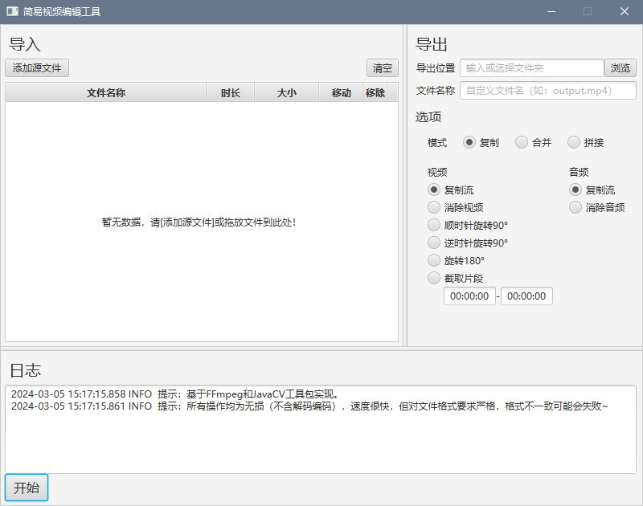

## 项目介绍

FFmpeg是十分强大的音视频处理工具，但使用时需要输入命令进行操作，对于一些简单的需求来说显然有些繁琐。

当然，目前也存在大量的视频剪辑软件，但其中大部分要么各种功能收费，要么缺少一些简单但必要的功能，要么导出速度很慢或者不能无损导出。

于是萌生了自己制作一款简易的视频编辑工具的想法，虽然不如现有的软件界面漂亮，功能也没那么丰富，但可作为一个补充，方便快速无损地完成一些简单的操作，也有其存在的价值。

---

### 技术栈

界面使用JavaFX制作，功能基于FFmpeg和JavaCV实现。

开发环境：Windows 10，Java 17 [Windows平台打包方法](docs/README.md)

### 功能

* 复制模式

    支持将一个视频文件进行画面旋转（修改display_rotation属性）、截取片段，提取视频或音频。

* 合并模式

    支持将一个视频文件和一个音频文件合并为一个文件。

* 拼接模式

    支持将多个视频文件首尾连接成一个文件。

### 界面预览

